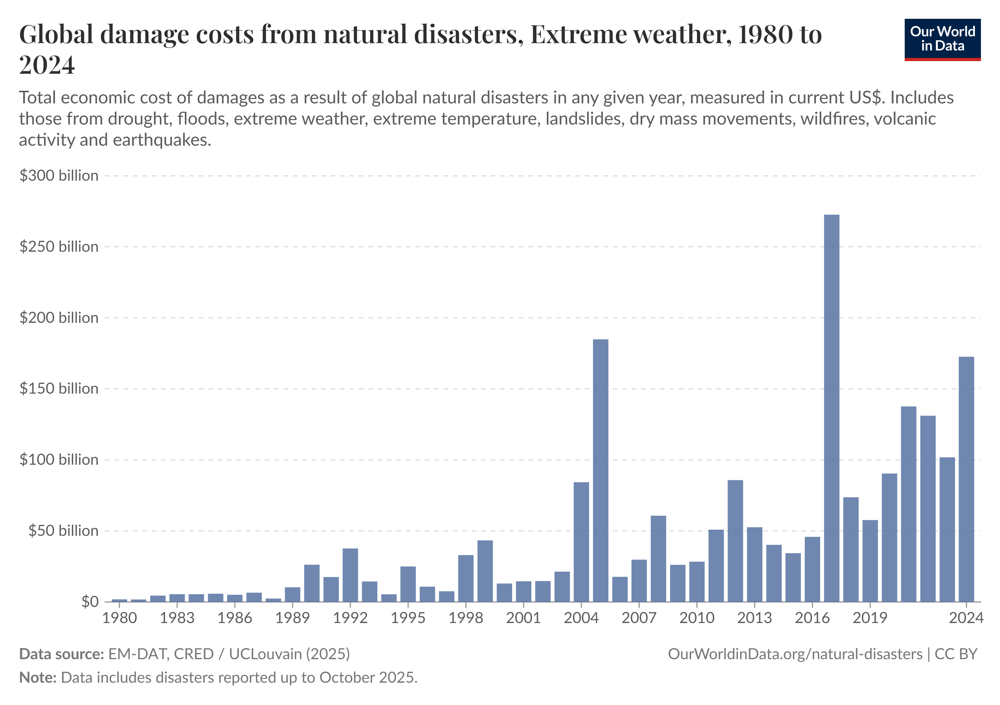
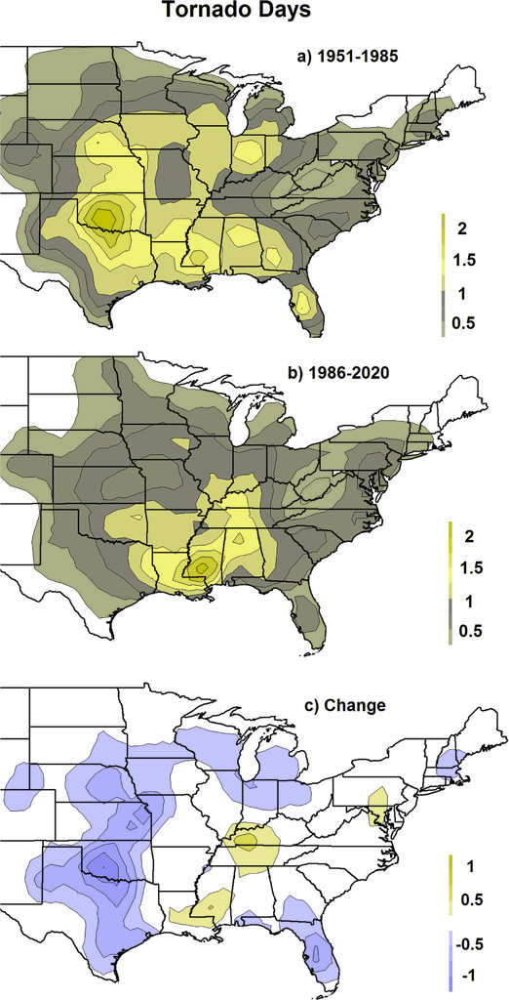

## [Climate Change's Impact on U.S. Businesses]{style="font-size: .9em;"}

::: {layout-align="center"}
{style="border: 2px solid black; display: block; margin: 0 auto;" height="600px"}
:::

## Shifting Climate Dynamics

:::: {.columns}

::: {.column width="65%"}
-   Movement of Tornado Alley
       - Middle America to the Southeast
       - Shift into Hurricane Zones
-   Marine Life Migration Pattern Changes
       - Marine Life is moving away from the Gulf during Summer Months
       - Preference for Northeast, Cooler Climates
-   Stronger Natural Disasters
-   Economic Impact
:::

::: {.column width="35%"}
{style="border: 2px solid black; display: block; margin: -30px auto 0 auto;" height="600px"}
:::
::::

## Research Question

::: {style="text-align: center; font-size: 1.75em; font-weight: bold; margin-top: 100px;"}
How likely is it that the conditions needed to form a [strong]{.underline}, [land-driven]{.underline}, and [shark-populated]{.underline} tornado occur simultaneously somewhere along the U.S. coast?
:::

## Research Components

Use of National Oceanic Atmospheric Association (NOAA) Data for Extreme Weather and Shark Capture

[Components]{.underline}

-   Tornado Strength
       - EF3 or Higher
-   Tornado Path
       - Needs to Move Inland or Along the Coast
-   Buffer Zone of Interest
       - 20 Mile Zone to Capture the Continental Shelf
-   Shark Presence along the Tornado's Path

## Research Area of Interest

:::: {.columns}

::: {.column width="40%"}
[States Used in Analysis]{.underline}

-   Texas
-   Louisiana
-   Mississippi
-   Alabama
-   Florida
-   Georgia
-   South Carolina
-   North Carolina
:::

::: {.column width="60%"}
::: {style="width: 110%; margin-left: -0.5%; margin-top: 80px;"}
```{r}
#| echo: false
#| warning: false
#| out-width: "100%"

storm2021 <- read.csv("storm2021.csv")
storm2022 <- read.csv("storm2022.csv")
storm2023 <- read.csv("storm2023.csv")
storm2024 <- read.csv("storm2024.csv")
storm2025 <- read.csv("storm2025.csv")

tor21 <- storm2021[,c("STATE", "BEGIN_LON", "END_LON", "BEGIN_LAT", "END_LAT", "TOR_F_SCALE", "EVENT_TYPE", "EVENT_NARRATIVE")]
tor22 <- storm2022[,c("STATE", "BEGIN_LON", "END_LON", "BEGIN_LAT", "END_LAT", "TOR_F_SCALE", "EVENT_TYPE", "EVENT_NARRATIVE")]
tor23 <- storm2023[,c("STATE", "BEGIN_LON", "END_LON", "BEGIN_LAT", "END_LAT", "TOR_F_SCALE", "EVENT_TYPE", "EVENT_NARRATIVE")]
tor24 <- storm2024[,c("STATE", "BEGIN_LON", "END_LON", "BEGIN_LAT", "END_LAT", "TOR_F_SCALE", "EVENT_TYPE", "EVENT_NARRATIVE")]
tor25 <- storm2025[,c("STATE", "BEGIN_LON", "END_LON", "BEGIN_LAT", "END_LAT", "TOR_F_SCALE", "EVENT_TYPE", "EVENT_NARRATIVE")] 
storm <- rbind(tor21, tor22, tor23, tor24, tor25)

library(maps)
library(stringr)

ec <- c("TEXAS", "LOUISIANA", "MISSISSIPPI", "ALABAMA", "FLORIDA", "GEORGIA", "SOUTH CAROLINA", "NORTH CAROLINA")

par(mar= c(0,0,0,0))

map("state", col="black", fill=FALSE, interior=TRUE)
map("state", regions=str_to_lower(ec), col="maroon", fill=TRUE, add=TRUE)

```
:::
:::
::::

## Results

```{r}
#| echo: false
#| warning: false
#| column: page
#| fig-width: 12
#| fig-height: 8
#| fig-align: center
#| fig-alt: "Starting Tornado Positions from 2021-2025"

library(viridis)

tornado <- storm[storm$EVENT_TYPE == "Tornado",]

ec.tornado <- tornado[tornado$STATE %in% ec,]
clean.tor <- ec.tornado[!is.na(ec.tornado$BEGIN_LON) & !is.na(ec.tornado$BEGIN_LAT) & !is.na(ec.tornado$TOR_F_SCALE), ]
clean.tor$EF_SCALE <- as.numeric(str_remove(clean.tor$TOR_F_SCALE, "EF"))
ef.scale <- viridis(6, direction=-1)

plot(clean.tor$BEGIN_LON, clean.tor$BEGIN_LAT, type="n", 
     xlab="Longitude",
     ylab="Latitude",
     asp=1,
     main="Starting Position of U.S. Tornados from 2021-2025")
map("state", col="grey", fill=FALSE, add=TRUE)
points(clean.tor$BEGIN_LON, clean.tor$BEGIN_LAT, 
       col=ef.scale[clean.tor$EF_SCALE+1], 
       pch=16)
legend("bottomright", 
       legend=c("EF0", "EF1", "EF2", "EF3", "EF4", "EF5"), 
       col=ef.scale[1:6],
       pch=16, 
       cex=1.2, 
       title="Starting EF Rating")

```

## Shark Sample Analysis

:::: {.columns}

::: {.column width="50%"}
```{r}
#| echo: false
#| tbl-alt: "Frequency of Sharks Species caught off U.S. Coastal Waters in Sample"

shark.survey <- read.csv("sharks.csv")
names(shark.survey)[names(shark.survey) == "Longitude.of.capture"] <- "cap.long"
names(shark.survey)[names(shark.survey) == "Latitude.of.Capture"] <- "cap.lat"

sharks <- shark.survey[shark.survey$TAXON %in% c("RHIZOPRIONODON TERRAENOVAE", "CARCHARHINUS PLUMBEUS", "CARCHARHINUS LIMBATUS", "CARCHARHINUS ACRONOTUS", "GALEOCERDO CUVIER", "MUSTELUS SINUSMEXICANUS", "CARCHARHINUS BREVIPINNA", "SPHYRNA LEWINI", "GINGLYMOSTOMA CIRRATUM"),]
sharks20 <- sharks[sharks$YEAR>=2021,]

shark.species <- data.frame(sort(table(sharks20$TAXON), decreasing=TRUE))

shark.species9 <- shark.species[1:9,]
names(shark.species9)[names(shark.species9) == "Var1"] <- "scientific_name"
names(shark.species9)[names(shark.species9) == "Freq"] <- "frequency"

knitr::kable(shark.species9, 
             format= "html", 
             table.attr = "border='1' style='font-size: 0.83em; width: auto; margin: auto; border-collapse: 
             collapse;'")

```
:::
::: {.column width="50%"}
{style="border: 2px solid black; display: block; margin-left: auto; margin-right: 0; width: 85%;"}

{style="border: 2px solid black; display: block; margin-left: auto; margin-right: 0; width: 85%;"}
:::
::::

## Shark Capture Locations

```{r}
#| echo: false
#| column: page
#| fig-width: 12
#| fig-height: 8
#| fig-align: center
#| fig-alt: "Spatial Map of the Location of Shark Captures between 2021-2025"

plot(sharks20$cap.long, sharks20$cap.lat, 
     xlab="Capture Longitude",
     xlim=c(-95, -75), 
     ylab="Capture Latitude",
     ylim=c(24, 38), 
     asp=1,
     main="Shark Capture Locations from 2021-2025",
     col="lightblue",
     pch=16, 
     cex=1)
map("state", col="grey", fill=FALSE, add=TRUE)

```

## Buffer Results

```{r}
#| echo: false
#| warning: false
#| column: page
#| fig-width: 12
#| fig-height: 8
#| fig-align: center
#| fig-alt: "Starting Tornado Positions from 2021-2025"

library(sf)

strong.tor <- clean.tor[clean.tor$EF_SCALE>=3,]
sf_use_s2(FALSE)
states_sf <- st_as_sf(map("state", plot=FALSE, fill=TRUE))
states_sf <- st_make_valid(states_sf)
state.lines <- st_cast(st_union(states_sf), "MULTILINESTRING")
sharknado.zone <- st_buffer(state.lines, dist=0.3)

plot(strong.tor$BEGIN_LON, strong.tor$BEGIN_LAT, type="n", 
     xlab="Longitude",
     xlim=c(-95, -75),
     ylab="Latitude",
     ylim=c(24, 38),
     asp=1,
     main="Starting Position of Potnential Shark-Lifting U.S. Tornados from 2021-2025")
map("state", col="grey", fill=FALSE, add=TRUE)
points(strong.tor$BEGIN_LON, strong.tor$BEGIN_LAT, 
       col=ef.scale[strong.tor$EF_SCALE+1], 
       pch=16,
       cex=1.2)
points(sharks20$cap.long, sharks20$cap.lat,
       col="lightblue", 
       pch=16,
       cex=1.2)
legend("bottomright", 
       legend = c("EF3", "EF4", "EF5"), 
       col=ef.scale[4:6],
       pch=16, 
       cex=1.2, 
       title="Starting EF Rating",
       bg="white")
plot(sharknado.zone, col=adjustcolor("orange", alpha.f=0.4), border=NA, add=TRUE)

```

## Buffer Results

```{r}
#| echo: false
#| warning: false
#| column: page
#| fig-width: 12
#| fig-height: 8
#| fig-align: center
#| fig-alt: "Ending Tornado Positions from 2021-2025 (Line-Segments show Tornado Path)"

plot(strong.tor$END_LON, strong.tor$END_LAT, type="n", 
     xlab="Longitude",
     xlim=c(-95, -75),
     ylab="Latitude",
     ylim=c(24, 38),
     asp=1,
     main="Ending Position of Potential Shark-Lifting U.S. Tornados from 2021-2025")
segments(x0=strong.tor$BEGIN_LON,
         y0=strong.tor$BEGIN_LAT, 
         x1=strong.tor$END_LON,
         y1=strong.tor$END_LAT, 
         col=adjustcolor("black", alpha.f=1.5), lwd=1)
points(strong.tor$BEGIN_LON, strong.tor$BEGIN_LAT, 
       col=adjustcolor("darkgrey", alpha.f=1), 
       pch=16, 
       cex=1.2)
points(strong.tor$END_LON, strong.tor$END_LAT, 
       col=ef.scale[strong.tor$EF_SCALE+1],
       pch=16)
points(sharks20$cap.long, sharks20$cap.lat,
       col="lightblue", 
       pch=16,
       cex=1.2)
plot(sharknado.zone, col=adjustcolor("orange", alpha.f=0.4), border=NA, add=TRUE)
map("state", col="grey", fill=FALSE, add=TRUE)
legend("bottomright", 
       legend=c("EF3", "EF4", "EF5"), 
       col=ef.scale[4:6],
       pch=16, 
       cex=1.2, 
       title="Ending EF Rating")

```

## Buffer Results

$$ \frac{8}{321} = 2.49\% \text{ of Tornados } (\ge EF3) \text{ fell within the Buffer Zone} $$
$$ \frac{148}{2,831} = 5.23\% \text{ of Sharks were located within the Buffer Zone} $$

## Cluster Analysis

```{r}
#| echo: false
#| warning: false

library(sf)
library(class)

set.seed(251349262)
RNGkind(sample.kind="Rounding")

sharks.sf <- st_as_sf(sharks20, 
                      coords=c("cap.long", "cap.lat"), 
                      crs=st_crs(states_sf))
unqiue.sharks.sf <- unique(sharks.sf)
sharks.matrix <- st_intersects(unqiue.sharks.sf, sharknado.zone, sparse=FALSE)
unique.shark.count <- sum(rowSums(sharks.matrix)>0)

strong.tor_clean <- strong.tor[!is.na(strong.tor$BEGIN_LON) & !is.na(strong.tor$BEGIN_LAT),]
sf_strong.tor <- st_as_sf(strong.tor_clean, 
                          coords=c("BEGIN_LON", "BEGIN_LAT"), 
                          crs=st_crs(states_sf))
unique.sharks.sf <- unique(sf_strong.tor)
tor.matrix <- st_intersects(unique.sharks.sf, sharknado.zone, sparse=FALSE)
unique.tor.count <- sum(rowSums(tor.matrix)>0)

```

```{r}
#| echo: false
#| warning: false

set.seed(251349262)
RNGkind(sample.kind="Rounding")

sharks.zone <- unqiue.sharks.sf[rowSums(sharks.matrix)>0,]
sharks.zone <- sharks.zone[order(st_coordinates(sharks.zone)[,1]),]
tor.zone <- sf_strong.tor[rowSums(tor.matrix)>0,]
ocean.zone <- st_sample(sharknado.zone, size=2675)

shark.loc <- st_coordinates(sharks.zone)
ocean.loc <- st_coordinates(ocean.zone)
train.data <- rbind(shark.loc, ocean.loc)
test.data  <- st_coordinates(tor.zone)

table.labels <- c(rep("Shark_Present", nrow(shark.loc)), 
                  rep("No_Sharks_Present", nrow(ocean.loc)))

summarize.class <- function(original, classify) {
  class.table <- table(original, classify)
  numb <- rowSums(class.table)
  prop <- round(class.table/numb,4)
  overall <- round(sum(diag(class.table))/sum(class.table),4)
  list(class.table = class.table, prop = prop, overall.correct = overall)
}

save.results.cv <- matrix(data = NA, nrow = 30, ncol = 4)
colnames(save.results.cv) <- c("K", "Prop.Shark", "Prop.NoShark", "Prop.Overall")

for (K in 1:30) {
  NNC.cv <- knn.cv(train = train.data, cl = table.labels, k = K)
  NNC.cv.accuracy <- summarize.class(original = table.labels, classify = NNC.cv)
  save.results.cv[K,] <- c(K, 
                           NNC.cv.accuracy$prop[1,1], 
                           NNC.cv.accuracy$prop[2,2], 
                           NNC.cv.accuracy$overall.correct)
}

```

```{r}
#| echo: false
#| warning: false

set.seed(251349262)
RNGkind(sample.kind="Rounding")

plot(x=save.results.cv[,1],
     y=save.results.cv[,4], 
     main="Overall Accuracy Rates for Values of K", 
     panel.first=grid(), 
     type="o", 
     col="black", 
     xlab="K", 
     ylab="Accuracy Percenatge (%)",
     ylim=c(0.9475 , 0.97))
k.max <- save.results.cv[save.results.cv[,1]>4,][which.max(save.results.cv[save.results.cv[,1]>4,4]), 1]
k.accuracy <- save.results.cv[save.results.cv[,1] == k.max, 4]
abline(v=k.max, lty="dashed", col="maroon")

```

## Buffer Clustering Results

::: {.fragment}

```{r}
#| echo: false
#| warning: false
#| tbl-alt: "Classifications of Tornados based on Location to Shark-Populated Waters (k=9)"

sharks.sf <- st_as_sf(sharks20, 
                      coords=c("cap.long", "cap.lat"), 
                      crs=st_crs(states_sf))
unqiue.sharks.sf <- unique(sharks.sf)
sharks.matrix <- st_intersects(unqiue.sharks.sf, sharknado.zone, sparse=FALSE)
unique.shark.count <- sum(rowSums(sharks.matrix)>0)

strong.tor_clean <- strong.tor[!is.na(strong.tor$BEGIN_LON) & !is.na(strong.tor$BEGIN_LAT),]
sf_strong.tor <- st_as_sf(strong.tor_clean, 
                          coords=c("BEGIN_LON", "BEGIN_LAT"), 
                          crs=st_crs(states_sf))
unique.sharks.sf <- unique(sf_strong.tor)
tor.matrix <- st_intersects(unique.sharks.sf, sharknado.zone, sparse=FALSE)
unique.tor.count <- sum(rowSums(tor.matrix)>0)

library(class)
set.seed(349262251)

sharks.zone <- unqiue.sharks.sf[rowSums(sharks.matrix)>0,]
tor.zone <- sf_strong.tor[rowSums(tor.matrix)>0,]
ocean.zone <- st_sample(sharknado.zone, size=2675)

shark.loc <- st_coordinates(sharks.zone)
ocean.loc <- st_coordinates(ocean.zone)
train.data <- rbind(shark.loc, ocean.loc)
test.data  <- st_coordinates(tor.zone)

table.labels <- c(rep("Shark_Present", nrow(shark.loc)), 
                  rep("No_Sharks_Present", nrow(ocean.loc)))

summarize.class <- function(original, classify) {
  class.table <- table(original, classify)
  numb <- rowSums(class.table)
  prop <- round(class.table/numb,4)
  overall <- round(sum(diag(class.table))/sum(class.table),4)
  list(class.table = class.table, prop = prop, overall.correct = overall)
}

save.results.cv <- matrix(data = NA, nrow = 30, ncol = 4)
colnames(save.results.cv) <- c("K", "Prop.Shark", "Prop.NoShark", "Prop.Overall")

for (K in 1:30) {
  NNC.cv <- knn.cv(train = train.data, cl = table.labels, k = K)
  NNC.cv.accuracy <- summarize.class(original = table.labels, classify = NNC.cv)
  save.results.cv[K,] <- c(K, 
                           NNC.cv.accuracy$prop[1,1], 
                           NNC.cv.accuracy$prop[2,2], 
                           NNC.cv.accuracy$overall.correct)
}

knn.pred <- knn(train=train.data, 
                      test=test.data, 
                      cl=table.labels, 
                      k=9, 
                      prob=TRUE)

knn.table <- data.frame(Tornado_Number=1:nrow(tor.zone),
                        Classification=knn.pred,
                        Confidence=attr(knn.pred, "prob"))
knitr::kable(knn.table)

```

:::

::: {.fragment}
[Conclusion:]{.underline} **A shark-populated tornado poses no serious or tangible threat to this company.**
:::

## Recommendations

**1)**  The company should coordinate with its corporate and governmental partners to enact climate-friendly policies aimed at slowing the rate of global warming.


**2)**  The company should review its current contingency procedures regarding extreme weather events to ensure there are sufficient plans-of-action in the event of a strong tornado causing substantial damage to company property.

## 

::: {style="text-align: center; font-size: 2.5em; font-weight: bold; margin-top: 300px;"}
Questions?
:::
