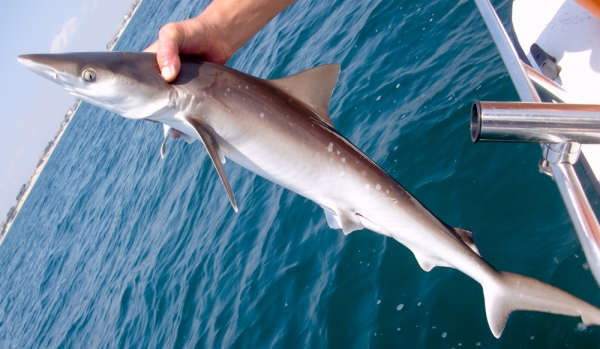
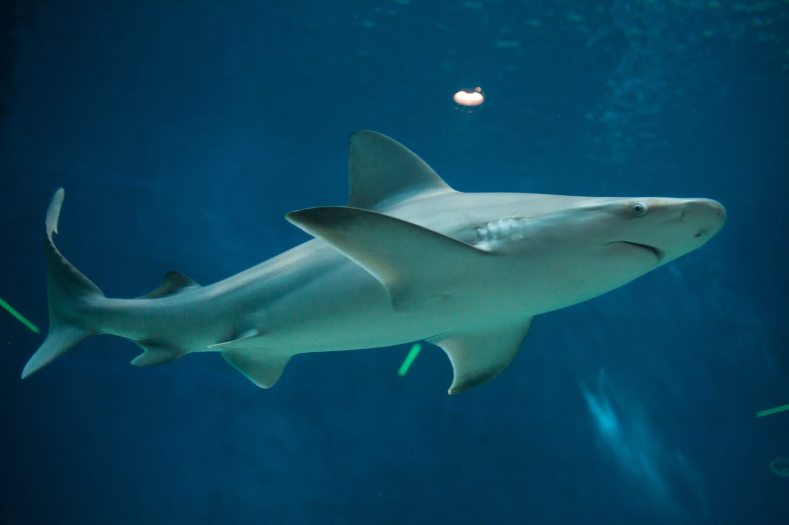

# Methodology and Results {#sec-results}

## Methodology

This research is being conducted based on tornado path and shark location data collected between January 2021 and December 2025. This was done because a shifting climate has pushed tornadoes southeast [@ColemanSpatial2024], while shark populations are beginning to move into North Atlantic coasts due to rising ocean temperatures in the Gulf of Mexico and the South Atlantic [@OceanSharkStudy]. While it is impossible to assess the full impact of these climate shifts, as they are still currently taking place, data collected in the past 5 years will produce results that best reflect these shifting dynamics. Because the data used in this analysis for monitoring shark locations only spans from Texas to North Carolina, only the following states from that analysis were used:

::: {.callout-tip}
## States used in this Analysis

-   Texas
-   Louisiana
-   Mississippi
-   Alabama
-   Florida
-   Georgia
-   South Carolina
-   North Carolina
:::

@fig-states is provided as a visual reference for the locations of the states used in this analysis.

```{r}
#| echo: false
#| warning: false
#| label: fig-states
#| fig-cap: "Map of States used in this Analysis. Maps that are colored represent states whose data was used in the analysis, as they had available data about both tornados and sharks"

set.seed(251349262)
RNGkind(sample.kind="Rounding")

library(maps)
library(stringr)
library(viridis)
library(class)

ec <- c("TEXAS", "LOUISIANA", "MISSISSIPPI", "ALABAMA", "FLORIDA", "GEORGIA", "SOUTH CAROLINA", "NORTH CAROLINA")

map("state", col="grey", fill=FALSE)
map("state", regions=str_to_lower(ec), col="maroon", fill=TRUE, add=TRUE)
title("States used in Analysis")

```

Spatial analysis will be used to determine how many sharks and tornados fall into a buffer zone off the coast of the states seen in @fig-states. This buffer zone will represent an area where the formation of a tornado, combined with any presence of sharks, could create the conditions needed for the tornado to lift the shark and displace it inland near a major population center.

Following this, tornados will be classified using a nearest neighbor classification system. A k-table test will be run to determine the appropriate number of neighbors to use, where the value of k chosen will be the one that has the highest overall accuracy rate. Based on this k-test, a k-means nearest neighbor classification system will be run for all tornados captured within the buffer zone, which will classify tornados based on whether sharks are present within the tornado's path within the buffer. This will also result in a confidence estimate that will help identify the likelihood of these two events occurring simultaneously. A k-nearest neighbors approach is used because the data is location-based/geographic in nature, and identifying overlapping and related regions through a binary classification system (shark presence against non-shark presence) are an integral part of this analysis.

## Results

### Tornado Data Analysis Results

```{r}
#| echo: false
#| warning: false

storm2021 <- read.csv("storm2021.csv")
storm2022 <- read.csv("storm2022.csv")
storm2023 <- read.csv("storm2023.csv")
storm2024 <- read.csv("storm2024.csv")
storm2025 <- read.csv("storm2025.csv")

tor21 <- storm2021[,c("STATE", "BEGIN_LON", "END_LON", "BEGIN_LAT", "END_LAT", "TOR_F_SCALE", "EVENT_TYPE", "EVENT_NARRATIVE")]
tor22 <- storm2022[,c("STATE", "BEGIN_LON", "END_LON", "BEGIN_LAT", "END_LAT", "TOR_F_SCALE", "EVENT_TYPE", "EVENT_NARRATIVE")]
tor23 <- storm2023[,c("STATE", "BEGIN_LON", "END_LON", "BEGIN_LAT", "END_LAT", "TOR_F_SCALE", "EVENT_TYPE", "EVENT_NARRATIVE")]
tor24 <- storm2024[,c("STATE", "BEGIN_LON", "END_LON", "BEGIN_LAT", "END_LAT", "TOR_F_SCALE", "EVENT_TYPE", "EVENT_NARRATIVE")]
tor25 <- storm2025[,c("STATE", "BEGIN_LON", "END_LON", "BEGIN_LAT", "END_LAT", "TOR_F_SCALE", "EVENT_TYPE", "EVENT_NARRATIVE")] 
storm <- rbind(tor21, tor22, tor23, tor24, tor25)

```

```{r}
#| echo: false
#| warning: false
#| layout-ncol: 2
#| column: page
#| fig-width: 7
#| fig-height: 5
#| fig-subcap: 
#|   - "Starting Tornado Positions from 2021-2025"
#|   - "Tornado Trajectories from 2021-2025"
#| label: fig-tornado-location

tornado <- storm[storm$EVENT_TYPE == "Tornado",]

ec.tornado <- tornado[tornado$STATE %in% ec,]
clean.tor <- ec.tornado[!is.na(ec.tornado$BEGIN_LON) & !is.na(ec.tornado$BEGIN_LAT) & !is.na(ec.tornado$TOR_F_SCALE), ]
clean.tor$EF_SCALE <- as.numeric(str_remove(clean.tor$TOR_F_SCALE, "EF"))
ef.scale <- viridis(6, direction=-1)

plot(clean.tor$BEGIN_LON, clean.tor$BEGIN_LAT, type="n", 
     xlab="Longitude",
     ylab="Latitude",
     asp=1,
     main="Starting Position of U.S. Tornados from 2021-2025")
map("state", col="grey", fill=FALSE, add=TRUE)
points(clean.tor$BEGIN_LON, clean.tor$BEGIN_LAT, 
       col=ef.scale[clean.tor$EF_SCALE+1], 
       pch=16)
legend("bottomright", 
       legend=c("EF0", "EF1", "EF2", "EF3", "EF4", "EF5"), 
       col=ef.scale[1:6],
       pch=16, 
       cex=0.7, 
       title="Starting EF Rating")

plot(clean.tor$END_LON, clean.tor$END_LAT, type="n", 
     xlab="Longitude",
     ylab="Latitude",
     asp=1,
     main="Trajectories of U.S. Tornados from 2021-2025")
segments(x0=clean.tor$BEGIN_LON,
         y0=clean.tor$BEGIN_LAT, 
         x1=clean.tor$END_LON,
         y1=clean.tor$END_LAT, 
         col=adjustcolor("black", alpha.f=1.5), 
         lwd=1.5)
map("state", col="grey", fill=FALSE, add=TRUE)

```

@fig-tornado-location-1 shows all recorded tornados in states that border the Gulf of Mexico[^methods_and_results-1] or the Atlantic Ocean. The color of each dot represents the EF rating of the tornado. In total, 3,116 observations were collected within the area of interest.

[^methods_and_results-1]: As the majority of the data for both sharks and tornados was collected before 2025, it is internally referred to as the "Gulf of Mexico" rather than the "Gulf of America" in the raw data files. To avoid confusion and to maintain consistency, this report uses the older term "Gulf of Mexico" to describe the body of water located south of the U.S. to align with the internal raw data.

@fig-tornado-location-2 shows the trajectories of all tornados from @fig-tornado-location-1. Most of the tornadoes do not tend to travel far from their original spot in comparison to the size of the U.S., and there is a much higher concentration of tornados moving northeast through states like Alabama and Mississippi.

### Shark Data Analysis

```{r}
#| echo: false
#| label: tbl-sharks
#| tbl-cap: "Frequency of Sharks Species caught off U.S. Coastal Waters in Sample"

shark.survey <- read.csv("sharks.csv")
names(shark.survey)[names(shark.survey) == "Longitude.of.capture"] <- "cap.long"
names(shark.survey)[names(shark.survey) == "Latitude.of.Capture"] <- "cap.lat"

sharks <- shark.survey[shark.survey$TAXON %in% c("RHIZOPRIONODON TERRAENOVAE", "CARCHARHINUS PLUMBEUS", "CARCHARHINUS LIMBATUS", "CARCHARHINUS ACRONOTUS", "GALEOCERDO CUVIER", "MUSTELUS SINUSMEXICANUS", "CARCHARHINUS BREVIPINNA", "SPHYRNA LEWINI", "GINGLYMOSTOMA CIRRATUM"),]
sharks20 <- sharks[sharks$YEAR>=2021,]

shark.species <- data.frame(sort(table(sharks20$TAXON), decreasing=TRUE))

shark.species9 <- shark.species[1:9,]
names(shark.species9)[names(shark.species9) == "Var1"] <- "scientific_name"
names(shark.species9)[names(shark.species9) == "Freq"] <- "frequency"
knitr::kable(head(shark.species9, 9))

```

::: aside
{style="border: 2px solid black;"} Atlantic Sharpnose Shark (Rhizoprionodon Terranovae)

------------------------------------------------------------------------

{style="border: 2px solid black;"} Sandbar Shark (Carcharhinus Plumbeus)
:::

------------------------------------------------------------------------

@tbl-sharks shows the frequency of sharks species caught off the Gulf and South Atlantic Coasts between 2021-2025. The shark species with the highest observed frequency was the Rhizopriondon Terranovae, whose common name is the Atlantic Sharpnose Shark, with 1,411 observations. The next highest was the Carcharhinus Plumbeus, whose common name is the Sandbar Shark, with 413 observations.

::: {.callout-warning}
## Divide between Sample Analysis Results and Public Perception

Based on our data, Rhizopriondon Terranovae made up 49.84% of the sample, and Carcharhinus Plumbeus made up 14.59% of the sample. Adult Rhizopriondon Terranovae tend to measure in between 2-3 ft long and can live up to 9 years [@AtlanticSharpnoseShark], and they are far from the stereotypical depiction of sharks that exist in the minds of the public despite representing almost a majority of this study's entire shark sample size.

:::

```{r}
#| echo: false
#| label: fig-shark-capture
#| fig-cap: "Spatial Map of the Location of Shark Captures between 2021-2025"

plot(sharks20$cap.long, sharks20$cap.lat, 
     xlab="Capture Longitude",
     xlim=c(-100, -70),
     ylab="Capture Latitude",
     ylim=c(20, 45),
     asp=1,
     main="Shark Capture Locations from 2021-2025",
     col="lightblue",
     pch=16, 
     cex=0.5)
map("state", col="grey", fill=FALSE, add=TRUE)

```

@fig-shark-capture shows the spatial distribution of shark capture locations since 2021. In total, 314 observations were captured between 2021-2025. It is important to note that the range of this data is only from the coast of Texas to North Carolina, and no data was able to be collected for sharks captured in the North Atlantic. Each dot represents one specific capture and a specific date, but it is possible that the same shark was captured at separate dates in separate or similar locations.

### Shark and Tornado Spatial Cross-Analysis

According to an analysis done by Kim Martini of Deep Sea News, the minimum wind speed that could, in theory, lift up medium-to-large sized sharks would be equivalent to an EF4 tornado [@RecipeSharknadoDeep]. To create a conservative estimate for smaller sharks, which based on the previous analysis, is the most prevalent size of sharks in the Gulf of Mexico and the South Atlantic, these analyses are being conditioned on tornados classified at a minimum of an EF3.

```{r}
#| echo: false
#| warning: false
#| layout-ncol: 2
#| column: page
#| fig-width: 8
#| fig-height: 6
#| fig-subcap: 
#|   - "Starting Tornado Positions from 2021-2025"
#|   - "Ending Tornado Positions from 2021-2025 (Line-Segments show Tornado Path)"
#| label: fig-sharknado-buffer

set.seed(251349262)
RNGkind(sample.kind="Rounding")

library(sf)

strong.tor <- clean.tor[clean.tor$EF_SCALE>=3,]
sf_use_s2(FALSE)
states_sf <- st_as_sf(map("state", plot=FALSE, fill=TRUE))
states_sf <- st_make_valid(states_sf)
state.lines <- st_cast(st_union(states_sf), "MULTILINESTRING")
sharknado.zone <- st_buffer(state.lines, dist=0.3)

plot(strong.tor$BEGIN_LON, strong.tor$BEGIN_LAT, type="n", 
     xlab="Longitude",
     xlim=c(-100, -70),
     ylab="Latitude",
     ylim=c(20, 45),
     asp=1,
     main="Starting Position of Potnential Shark-Lifting U.S. Tornados from 2021-2025")
map("state", col="grey", fill=FALSE, add=TRUE)
points(strong.tor$BEGIN_LON, strong.tor$BEGIN_LAT, 
       col=ef.scale[strong.tor$EF_SCALE+1], 
       pch=16)
points(sharks20$cap.long, sharks20$cap.lat,
       col="lightblue", 
       pch=16,
       cex=0.5)
legend("bottomright", 
       legend = c("EF3", "EF4", "EF5"), 
       col=ef.scale[4:6],
       pch=16, 
       cex=0.8, 
       title="Starting EF Rating")
plot(sharknado.zone, col=adjustcolor("orange", alpha.f=0.4), border=NA, add=TRUE)

plot(strong.tor$END_LON, strong.tor$END_LAT, type="n", 
     xlab="Longitude",
     xlim=c(-100, -70),
     ylab="Latitude",
     ylim=c(20, 45),
     asp=1,
     main="Ending Position of Potential Shark-Lifting U.S. Tornados from 2021-2025")
segments(x0=strong.tor$BEGIN_LON,
         y0=strong.tor$BEGIN_LAT, 
         x1=strong.tor$END_LON,
         y1=strong.tor$END_LAT, 
         col=adjustcolor("black", alpha.f=1.5), lwd=1)
points(strong.tor$BEGIN_LON, strong.tor$BEGIN_LAT, 
       col=adjustcolor("darkgrey", alpha.f=1), 
       pch=16, 
       cex=0.75)
points(strong.tor$END_LON, strong.tor$END_LAT, 
       col=ef.scale[strong.tor$EF_SCALE+1],
       pch=16)
points(sharks20$cap.long, sharks20$cap.lat,
       col="lightblue", 
       pch=16,
       cex=0.5)
plot(sharknado.zone, col=adjustcolor("orange", alpha.f=0.4), border=NA, add=TRUE)
map("state", col="grey", fill=FALSE, add=TRUE)
legend("bottomright", 
       legend=c("EF3", "EF4", "EF5"), 
       col=ef.scale[4:6],
       pch=16, 
       cex=0.8, 
       title="Ending EF Rating")

```

```{r}
#| echo: false
#| warning: false

set.seed(251349)
RNGkind(sample.kind="Rounding")

sharks.sf <- st_as_sf(sharks20, 
                      coords=c("cap.long", "cap.lat"), 
                      crs=st_crs(states_sf))
unqiue.sharks.sf <- unique(sharks.sf)
sharks.matrix <- st_intersects(unqiue.sharks.sf, sharknado.zone, sparse=FALSE)
unique.shark.count <- sum(rowSums(sharks.matrix)>0)

strong.tor_clean <- strong.tor[!is.na(strong.tor$BEGIN_LON) & !is.na(strong.tor$BEGIN_LAT),]
sf_strong.tor <- st_as_sf(strong.tor_clean, 
                          coords=c("BEGIN_LON", "BEGIN_LAT"), 
                          crs=st_crs(states_sf))
unique.sharks.sf <- unique(sf_strong.tor)
tor.matrix <- st_intersects(unique.sharks.sf, sharknado.zone, sparse=FALSE)
unique.tor.count <- sum(rowSums(tor.matrix)>0)

```

@fig-sharknado-buffer-1 shows the starting position of tornados relative to the location of sharks in the Gulf of Mexico and the South Atlantic, conditioned on the tornado strength being EF3 or higher. An EF3 is the minimum required tornado strength needed for even a plausible chance of picking up sharks. In total, 334 tornados in the past 5 years have been observed with an EF rating of at least 3.

@fig-sharknado-buffer-2 shows the ending positions of tornados relative to the location of sharks in the Gulf of Mexico and the South Atlantic, with the same conditions. The dark colored dots represents the ending location of the tornado, while the grey dot connected via a line segment represents the tornado's original position. The blue dots represent shark captures from 2021-2025. Over the past 5 years, only `r unique.tor.count` such tornados out of the total 321 in the sample are found within the buffer zone. Additionally, only `r unique.shark.count` of the 2,831 sharks from the sample were captured within the buffer region where a shark-populated tornado could form.

### Nearest Neighbor Classification for Tornado Paths Located within Buffer

```{r}
#| echo: false
#| warning: false
#| label: tbl-shark-ktab
#| tbl-cap: "k-Table for Nearest Neighbor Analysis for first 10 values of K"

set.seed(251349)
RNGkind(sample.kind="Rounding")

sharks.zone <- unqiue.sharks.sf[rowSums(sharks.matrix)>0,]
sharks.zone <- sharks.zone[order(st_coordinates(sharks.zone)[,1]),]
tor.zone <- sf_strong.tor[rowSums(tor.matrix)>0,]
ocean.zone <- st_sample(sharknado.zone, size=2675)

shark.loc <- st_coordinates(sharks.zone)
ocean.loc <- st_coordinates(ocean.zone)
train.data <- rbind(shark.loc, ocean.loc)
test.data  <- st_coordinates(tor.zone)

table.labels <- c(rep("Shark_Present", nrow(shark.loc)), 
                  rep("No_Sharks_Present", nrow(ocean.loc)))

summarize.class <- function(original, classify) {
  class.table <- table(original, classify)
  numb <- rowSums(class.table)
  prop <- round(class.table/numb,4)
  overall <- round(sum(diag(class.table))/sum(class.table),4)
  list(class.table = class.table, prop = prop, overall.correct = overall)
}

save.results.cv <- matrix(data = NA, nrow = 30, ncol = 4)
colnames(save.results.cv) <- c("K", "Prop.Shark", "Prop.NoShark", "Prop.Overall")

for (K in 1:30) {
  NNC.cv <- knn.cv(train = train.data, cl = table.labels, k = K)
  NNC.cv.accuracy <- summarize.class(original = table.labels, classify = NNC.cv)
  save.results.cv[K,] <- c(K, 
                           NNC.cv.accuracy$prop[1,1], 
                           NNC.cv.accuracy$prop[2,2], 
                           NNC.cv.accuracy$overall.correct)
}
knitr::kable(head(save.results.cv, 10))

```

```{r}
#| echo: false
#| warning: false
#| label: fig-shark-ktab
#| fig-cap: "Overall Accuracy Plot for first 10 values of K based on the k-Table"

set.seed(251349)
RNGkind(sample.kind="Rounding")

plot(x=save.results.cv[,1],
     y=save.results.cv[,4], 
     main="Overall Accuracy Rates for Values of K", 
     panel.first=grid(), 
     type="o", 
     col="black", 
     xlab="K", 
     ylab="Accuracy Percenatge (%)",
     ylim=c(0.9475 , 0.97))
k.max <- save.results.cv[save.results.cv[,1] > 4,][which.max(save.results.cv[save.results.cv[,1]>4,4]), 1]
k.accuracy <- save.results.cv[save.results.cv[, 1] == k.max, 4]
abline(v=k.max, lty="dashed", col="maroon")

```

::: callout-warning
## Rationale for Selecting an Appropriate Value of K

The highest value based on this analysis was `r k.max`, which produced an overall accuracy rate of `r k.accuracy`. The initial drop from k=1 to k=4 is disregarded due to the higher likelihood of an outlier affecting accuracy rates with a smaller number of neighbors (smaller value of k). 
:::

```{r}
#| echo: false
#| warning: false
#| label: tbl-shark-nnc
#| tbl-cap: "Classifications of Tornados based on Location to Shark-Populated Waters (k=9)"

set.seed(251349262)
RNGkind(sample.kind="Rounding")

knn.pred <- knn(train=train.data, 
                      test=test.data, 
                      cl=table.labels, 
                      k=9, 
                      prob=TRUE)

knn.table <- data.frame(Tornado_Number=1:nrow(tor.zone),
                        Classification=knn.pred,
                        Confidence=attr(knn.pred, "prob"))
knitr::kable(knn.table)

```

@tbl-shark-ktab is a table of k-Nearest Neighbor classification success rates, and @fig-shark-ktab is a plot showing the change in success rates based on the value of K. This table was used to select a value of k that best classifies tornado locations based on the proximity of sharks, conditioned on both the tornado and shark being located in the buffer. Based on this analysis, `r k.max` was used as it has a maximum overall success rate of `r k.accuracy`.

@tbl-shark-nnc is a table of classifications for all 8 tornados located within the buffer zone, listed as either "Sharks Present" if sharks were found to be in close proximity to the starting location of the tornado, or "No Sharks Present" if no sharks were found to be close enough. The table shows all 8 tornados fell under the classification of "No Sharks Present".

According to author Tom Sherrington, "While it’s not a universal certainty, storms can indeed influence shark distribution and bring them closer to shore due to a complex interplay of environmental factors ... \[it’s\] important to note that not all shark species respond to storms in the same way. Some species, like bull sharks, are known for their tolerance of brackish water and are more likely to be found closer to shore even under normal conditions. Others, like great white sharks, may venture closer to shore in search of larger prey that have been impacted by the storm" [@sherringtonStormsBringSharks2024]. As noted in @tbl-sharks, the most common species of sharks captured were the Atlantic Sharpnose and the Sandbar, and both species are sensitive to changes caused by tornados and hurricanes. This means that the calculated figure (`r k.max`) is likely an *underestimation of the true success rate*, given the fact that as a result of environmental conditions, these sharks will move further below the surface and/or away from the tornado.
